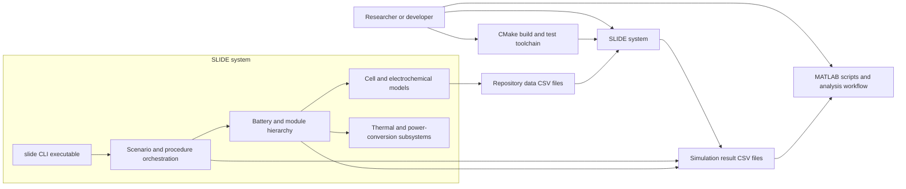
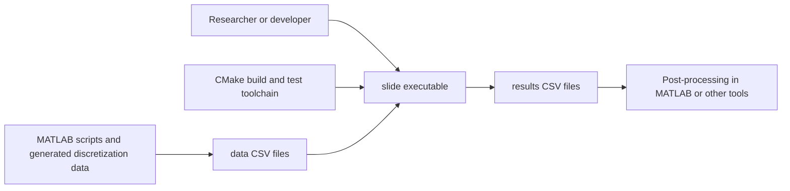
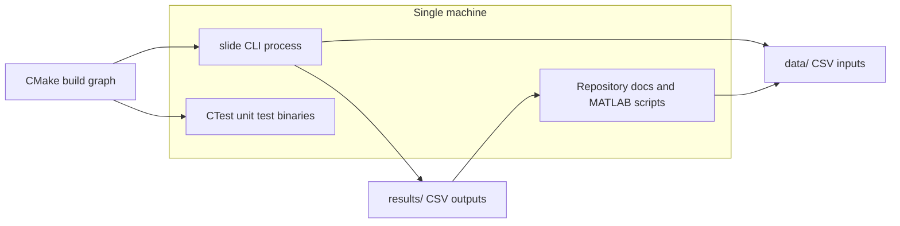
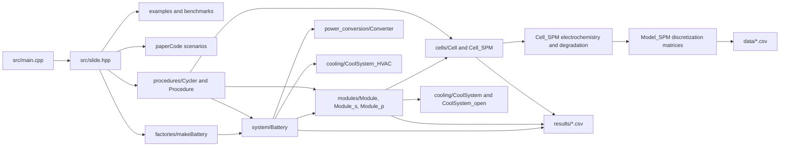
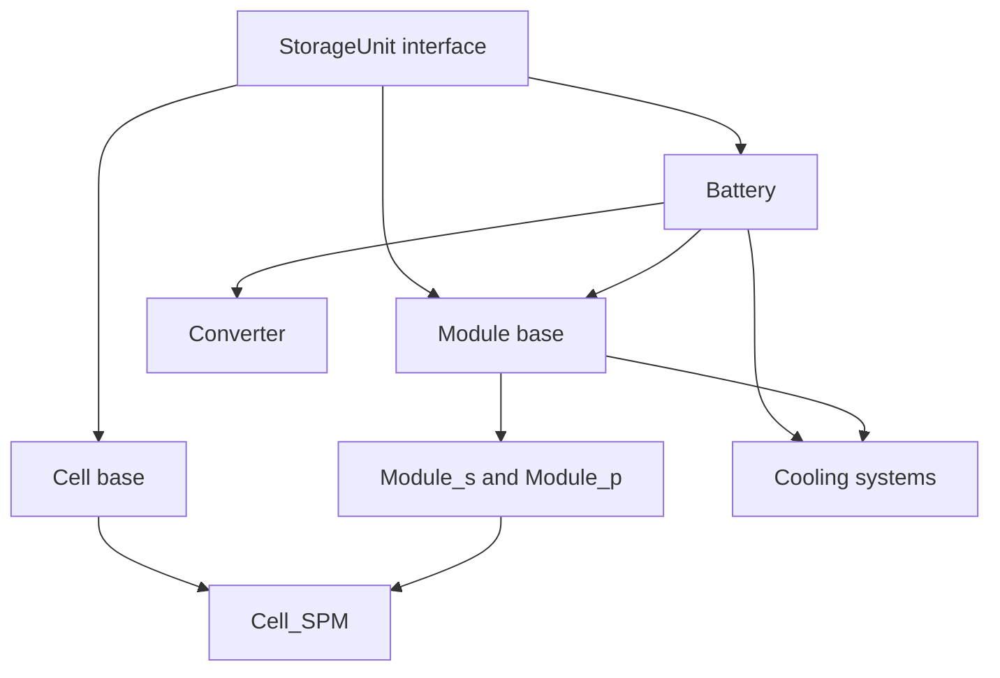
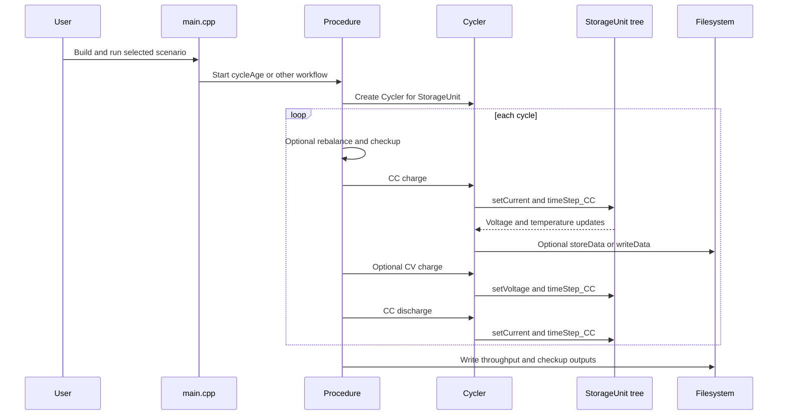
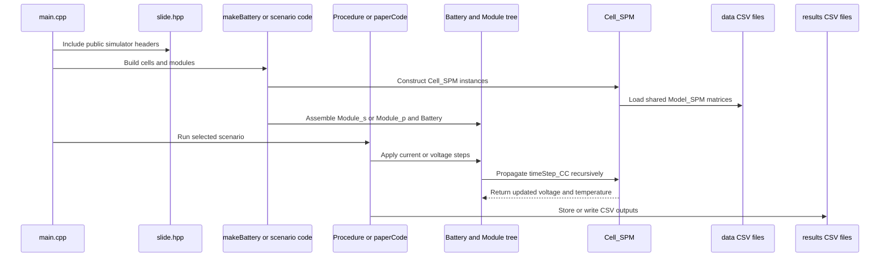
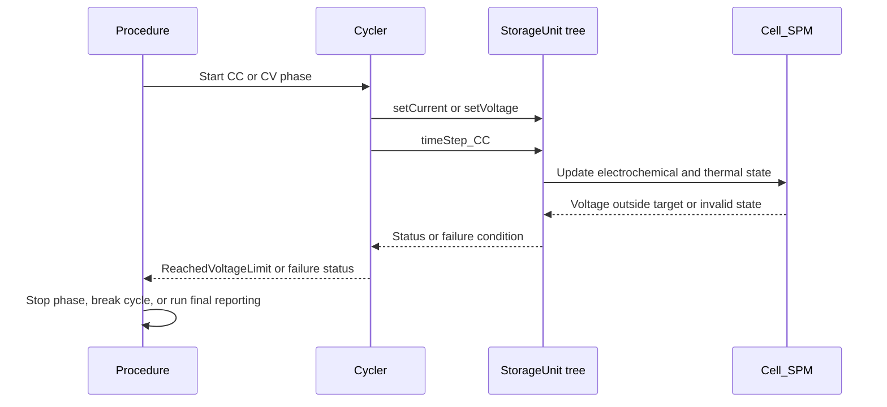
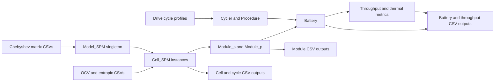
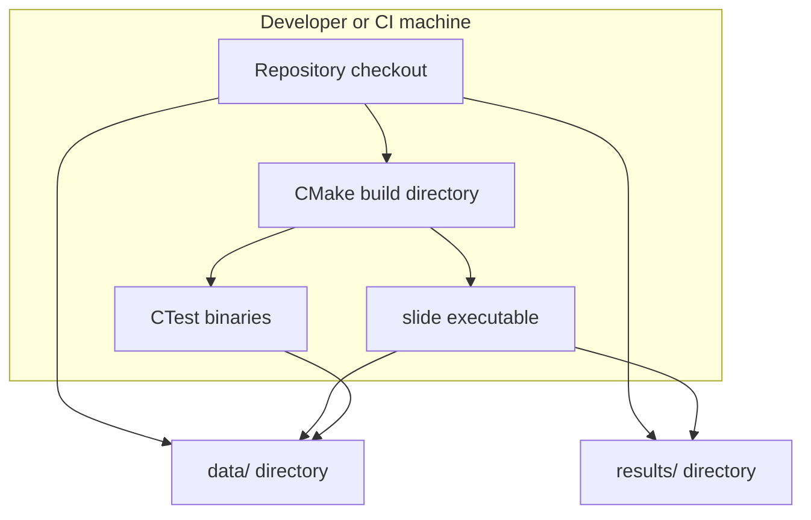

# SLIDE Architecture

## 1. Purpose and Scope

This document describes the current architecture of the SLIDE codebase as implemented in the repository. It focuses on the C++20 CMake-based simulation engine, the `slide` CLI executable, the major runtime modules, the hierarchical battery model, the control-flow orchestration in the cycling and procedure layers, and the file-based inputs and outputs that support simulation runs.

The scope of this document is limited to what is evidenced by the repository. The primary runtime entrypoint is the `slide` executable defined in `CMakeLists.txt` and implemented in `src/main.cpp`. This document does not invent planned services, APIs, or runtime modes that are not present in the code. Legacy and partially outdated procedure files under `src/procedures/degradation.*` are mentioned only as historical code paths because their interfaces do not match the currently active `Cycler` and `Procedure` APIs used by the main simulation path.

The document is considered complete when it explains how the executable is built, how the simulation object graph is assembled, how cycling logic drives the storage hierarchy, how thermal and degradation concerns are integrated, and how input and output files flow through the system.

## 2. Audience and Assumptions

This document is written for maintainers, researchers, and engineers who need to understand how SLIDE is structured before extending the simulator, adding new cell or module variants, or interpreting generated CSV outputs. It assumes the reader is comfortable with modern C++, CMake, and basic battery-model terminology such as state of charge, OCV, CC/CV cycling, and thermal coupling.

The runtime assumptions are simple and visible in the code. SLIDE is a local executable rather than a network service. It depends on the filesystem for reading model and parameter CSV files from the `data/` folder and for writing result CSV files to the `results/` folder. The code can use parallel execution internally, controlled by settings, but it still runs as a single host process. MATLAB is not required at runtime for the core executable, but MATLAB scripts are used offline to generate or post-process data referenced by the simulator.

## 3. System Context

At the highest level, SLIDE is a command-line simulation program that loads model discretization data and electrochemical lookup tables from disk, instantiates cell and pack structures in memory, executes cycling or benchmark logic, and writes CSV results for later analysis. Users interact by editing `src/main.cpp` to enable a chosen example or benchmark function and then building and running the executable.

The system boundary is the native executable plus its linked simulation library. External to the system are the human operator, the CMake toolchain, the CSV data files, and the optional MATLAB-based pre-processing and post-processing workflow.

### 3.1 High-Level C4-Style System Diagram (Mermaid)

The following diagram adds a higher-level C4-style view of the SLIDE system. It intentionally abstracts away individual classes and focuses instead on the main runtime system, the major internal capability groupings, and the external actors and file-based dependencies evidenced by `src/main.cpp`, `slide.hpp`, `CMakeLists.txt`, and the path definitions in `src/settings/slide_paths.hpp`.

This diagram should be read from the outside in. The user builds and runs the `slide` executable, the executable orchestrates simulation procedures, those procedures operate on the battery hierarchy and cell models, and the entire system consumes repository CSV inputs and writes CSV outputs for downstream MATLAB-based analysis.

### 3.1 Context Diagram (Mermaid)

The following diagram shows the executable at the center of the system context. The arrows indicate configuration, file inputs, and produced outputs.

The diagram should be read left to right. The user and build toolchain prepare and run the executable, the executable reads repository data files, and the resulting CSV artifacts are consumed by downstream analysis tools.

## 4. Containers / Runtime Units

SLIDE is not split into multiple deployable services. Instead, the repository contains one primary runtime container in the form of the `slide` process, plus supporting test and documentation targets.

At the build level, the top-level `CMakeLists.txt` creates the `slide` executable from `src/main.cpp` and links it against a static library target named `src`. The `src/CMakeLists.txt` file composes that library from `paperCode.cpp` plus subdirectories for `cells`, `modules`, `cooling`, `power_conversion`, `system`, `procedures`, `factories`, and `settings`. This structure shows that the repository is organized as a single native executable with a modular internal library rather than independent binaries. The same top-level CMake file also enables testing and adds the `tests/` tree.

The runtime model is therefore a single foreground process. The process reads static configuration from compile-time settings and repository files, constructs a simulation graph in memory, performs time integration and control logic, and emits CSV files. No network listeners, daemons, or background workers are defined in the current codebase.

### 4.1 Container Diagram (Mermaid)

This container view stays intentionally small because the codebase has only one primary runtime container. The test binaries are separate runtime artifacts, but they use the same core library concepts.

## 5. Components (per Container)

Inside the `slide` process, the code is structured as layered simulation components. The most important architectural boundary is the abstract `StorageUnit` interface in `src/StorageUnit.hpp`. `StorageUnit` defines the common contract for all runtime battery objects, including capacity, current, voltage, temperature, state access, time stepping, and data storage. Cells, modules, and batteries all implement this abstraction, which allows the procedure layer to operate generically on any storage hierarchy.

The next layer is the physical hierarchy. `Cell` in `src/cells/Cell.hpp` is the abstract single-cell specialization. `Cell_SPM` in `src/cells/Cell_SPM/Cell_SPM.hpp` is the principal electrochemical implementation and contains electrochemical state, degradation models, thermal accumulation, OCV curves, and a shared `Model_SPM` discretization object loaded from CSV files. `Module` in `src/modules/Module.hpp` aggregates child `StorageUnit` instances and implements shared behavior for thermal coupling, data storage, and recursive hierarchy traversal. `Module_s` and `Module_p` implement series and parallel electrical composition respectively. `Battery` in `src/system/Battery.hpp` wraps a top-level module, attaches an HVAC cooling system, and accounts for converter losses and top-level thermal behavior.

The orchestration layer sits above the physical hierarchy. `Cycler` in `src/procedures/Cycler.hpp` drives a connected `StorageUnit` through rest, constant-current, constant-voltage, and CCCV phases. `Procedure` in `src/procedures/Procedure.hpp` composes larger experiments such as long cycle ageing runs, rebalancing, checkups, throughput logging, and module reporting. The factory layer in `src/factories/makeBattery.cpp` assembles complex hierarchical pack topologies by instantiating cells, nesting modules, and attaching them to a `Battery`.

Cross-cutting infrastructure includes cooling classes under `src/cooling/`, the `Converter` under `src/power_conversion/Converter.hpp`, compile-time settings in `src/settings/settings.hpp`, and path definitions in `src/settings/slide_paths.hpp`. The `Model_SPM` class in `src/cells/Cell_SPM/Model_SPM.hpp` is particularly important because it loads the Chebyshev discretization matrices from repository CSV files and exposes them as a singleton shared by all SPM cells.

### 5.1 Component Diagram (Mermaid)

This component view should be read as a dependency graph. `main.cpp` includes `slide.hpp`, which exposes the major public subsystems. Those subsystems eventually manipulate the hierarchy rooted in `StorageUnit`, while the SPM model depends on discretization data and the hierarchy emits CSV outputs.

## 6. Low-Level Design (LLD)

The low-level design of SLIDE is centered on a recursive composite model. Every electrically meaningful object is a `StorageUnit`. Cells are leaves, modules are internal aggregation nodes, and the battery is the root-level wrapper that adds top-level cooling and conversion behavior. This gives the procedure layer a uniform way to call `setCurrent`, `V`, `timeStep_CC`, `getStates`, and `writeData` without hard-coding whether it is operating on a single cell or a large pack.

Three focus areas were selected for deeper LLD coverage because they have the highest architectural importance and the strongest fan-in from the rest of the codebase. The first focus area is the `StorageUnit` to `Battery` to `Module` to `Cell_SPM` hierarchy because it defines the structural and simulation core. The second is the `Cycler` and `Procedure` control layer because it governs runtime execution and data collection. The third is `Model_SPM` and the filesystem path layer because that is where the simulator crosses the boundary between compiled code and repository-supplied model data.

### 6.1 LLD Focus Area A: Hierarchical storage model

The `StorageUnit` base class defines the uniform contract used by the rest of the code. In `src/StorageUnit.hpp`, the class declares virtual methods for current setting, voltage computation, thermal modeling, time stepping, state serialization, and data persistence. This is the reason `Cycler` can hold only a `StorageUnit*` and still drive a cell, module, or battery.

`Battery` specializes this contract by holding a top-level `Module`, a `CoolSystem_HVAC`, and a `Converter`. The `setModule` implementation in `src/system/Battery.cpp` shows the intended ownership rule: a module can only be attached if it has no parent and is not already using an HVAC cool system. Once attached, the battery sets itself as the parent, creates the HVAC system, and scales the converter power using `Cap() * Vmax()`. That establishes the battery as the root of the electrical and thermal tree.

`Module` implements the recursive aggregation behavior. In `src/modules/Module.cpp`, `setSUs` moves child `StorageUnit` objects into the module, sets each child’s parent pointer, resets contact resistances, and computes the total nested cell count. `Module_s` and `Module_p` then define the electrical laws. `Module_s::V()` sums child voltages minus series contact drops, while `Module_p::getVall()` and `Module_p::redistributeCurrent()` model terminal voltage equalization across parallel branches including horizontal contact resistances.

At the leaf level, `Cell_SPM` holds the actual electrochemical state in `State_SPM`, degradation settings in `DEG_ID`, thermal accumulation fields, geometry, OCV curves, and a shared pointer to the singleton `Model_SPM`. Voltage is computed lazily in `Cell_SPM::V()` by deriving surface concentrations, interpolating electrode OCV curves, computing overpotentials, and subtracting DC resistance drop. Time stepping updates electrochemical state, thermal bookkeeping, and optionally degradation.

#### 6.1.1 LLD decomposition diagram (Mermaid)

This diagram emphasizes inheritance and containment. The battery contains a module tree, modules contain nested storage units, and cells terminate the recursion.

#### 6.1.2 Contracts

The input contract for this hierarchy is object composition plus runtime commands. Factories and examples provide constructor parameters such as degradation IDs, cell-to-cell variation factors, cooling controls, and counts of cells per module. `setCurrent`, `setVoltage`, `setStates`, and `timeStep_CC` operate over the already-built hierarchy.

The output contract is a combination of calculated electrical quantities, temperature updates, and CSV persistence. `V()`, `I()`, `Cap()`, `getThotSpot()`, and `getStates()` provide in-memory outputs. `storeData()` and `writeData()` serialize state and time-series data to result files. The main invariants are that parent pointers remain consistent, module compositions respect their electrical semantics, and temperatures and voltages stay inside modeled ranges or return error statuses.

The major side effects are recursive filesystem writes and mutation of shared runtime state. There is no network or database side effect in the current codebase.

### 6.2 LLD Focus Area B: Cycling and experiment orchestration

`Cycler` is the lowest orchestration layer that actively drives a `StorageUnit`. The constructor and `initialise` method simply bind a `StorageUnit*` plus a run identifier. The methods `rest`, `CC`, `CV`, and `CCCV_with_tlim` implement the main charge-discharge control sequences. `Cycler::CC` is particularly central. It sets the requested current, repeatedly calls `su->timeStep_CC(dti, nOnce)`, checks voltage conditions, accumulates throughput in `ThroughputData`, and conditionally stores data points. The function adapts `nOnce` to make larger grouped time steps when far from a voltage limit and smaller grouped steps as it approaches a limit.

`Procedure` composes those primitive phases into higher-level experiments. In `Procedure::cycleAge`, the code constructs a diagnostic `Cycler`, loops over many cycles, optionally performs balancing and checkups, executes CC and optional CV charge and discharge phases, stores throughput, and performs final reporting. Other methods such as `rebalance`, `checkUp`, `checkMod`, and `writeThroughput` add experiment management and reporting behavior on top of the primitive cycler operations.

The design choice here is clear: `Cycler` is the operational controller for one contiguous electrical action, while `Procedure` is the experiment workflow layer.

#### 6.2.1 Sequence diagram (Mermaid)

This sequence is the main happy path evidenced by `Procedure::cycleAge` and `Cycler::CC` and `Cycler::CV`.

#### 6.2.2 Contracts

The main input contract is a fully initialized `StorageUnit*` plus experiment parameters such as time step, voltage limits, C-rates, data sampling interval, and balancing policy. The main outputs are `Status` values describing why a phase stopped and accumulated throughput values in `ThroughputData`.

Error handling is status-driven rather than exception-driven at the orchestration level. `Cycler` returns status values such as `ReachedVoltageLimit`, `ReachedTimeLimit`, `ReachedCurrentLimit`, or failure states if voltage calculation or time stepping fails. Some lower-level code still throws integer error codes, and `Cycler` catches those in selected places to convert them into status results. This mixed error model is visible in the source and is an architectural characteristic of the current code.

### 6.3 LLD Focus Area C: Model data loading and path configuration

`Model_SPM` in `src/cells/Cell_SPM/Model_SPM.hpp` is the bridge between repository data files and the SPM solver. Its constructor reads arrays and matrices such as `Cheb_Nodes.csv`, `Cheb_Ap.csv`, `Cheb_An.csv`, `Cheb_Cp.csv`, and `Cheb_Q.csv` from `PathVar::data`. The static `makeModel()` method returns a singleton instance, ensuring the large discretization data is loaded once and shared by all SPM cells.

`PathVar` in `src/settings/slide_paths.hpp` defines the root, data, and results directories. When `SLIDE_ROOT_DIR` is not injected by CMake, the code falls back to `"../.."` as the root folder and then derives `results` and `data` paths from that root. This design keeps the codebase file-oriented and makes the executable dependent on its repository-relative folder structure.

The output side follows the same path abstraction. `Battery`, `Module`, `Cell`, and `Procedure` all write CSV files by composing names with prefixes and IDs. `Procedure::balanceCheckup`, `Procedure::checkMod`, and `Procedure::writeThroughput` explicitly write under `PathVar::results`.

#### 6.3.1 Data contract summary

The most important input files are the discretization CSVs in `data/`, the electrode OCV data files, and optional drive cycle profiles under `data/profiles/`. The most important outputs are time-series CSVs, checkup reports, module thermal summaries, throughput summaries, and state dumps in `results/`.

The main invariant is that the matrix files and runtime setting `settings::nch` must stay aligned. `Model_SPM` and `Cell_SPM::checkModelparam()` explicitly check that the MATLAB-generated discretization inputs match the compile-time assumptions.

## 7. Key Flows (Sequence Diagrams)

The primary end-to-end runtime flow is a simulation selected in `main.cpp`, built from the `slide.hpp` umbrella include, and executed through factories and procedures into the storage hierarchy. The main alternative flow is that a voltage or time limit halts a CC or CV step before the nominal target work is complete.

### 7.1 Primary flow

This sequence shows the normal path from program start to results generation.

### 7.2 Alternative flow: limit reached or calculation failure

The important architectural point is that the control layer stops on domain conditions such as target voltage reached, not just on completion of a fixed iteration count.

## 8. Data Flow and Storage

The repository uses straightforward file-based data exchange. Input data is read from the `data/` tree. The most critical files are the Chebyshev discretization matrices consumed by `Model_SPM`, electrode OCV curves, entropic coefficient curves, and current profiles. Some of these files are generated or maintained by MATLAB scripts, but at runtime they are treated as plain CSV inputs.

Within the process, data flows from input files into long-lived model objects and then through recursive updates over the storage hierarchy. `Model_SPM` loads its discretization arrays once. `Cell_SPM` uses those arrays together with per-cell state and OCV curves to compute voltage, diffusion, thermal generation, and degradation. Modules then aggregate electrical and thermal behavior. The battery adds converter losses and root cooling behavior. `Cycler` and `Procedure` capture runtime metrics and trigger persistence.

Output data is persisted in CSV form to the `results/` directory. Time-series data can be emitted by cells and modules through `storeData()` and `writeData()`. Higher-level summaries are emitted by `Procedure`, including throughput files, module cooling summaries, checkup dumps, and state snapshots.

### 8.1 Dataflow Diagram (Mermaid)

This diagram shows both static data inputs and dynamic output products. The runtime computation is centered on cell instances and then aggregated upward.

## 9. Deployment / Execution Topology

The codebase is designed for single-machine execution. There is no cluster scheduler integration, no RPC boundary, and no distributed service topology. Internal parallelism is provided by helper utilities controlled by `settings::isParallel` and `settings::numMaxParallelWorkers`, and modules can set a `par` flag to enable multithreaded operations over child storage units.

The deployment topology is therefore a workstation or CI runner that builds the executable with CMake, launches the binary locally, and stores data on the same filesystem. The same repository also supports unit tests through CTest. MATLAB scripts are used externally on the same or another workstation to generate discretization data or post-process results.

### 9.1 Deployment Diagram (Mermaid)

This deployment view is intentionally simple because the architecture is local and file-based.

## 10. Interfaces and Integration Points

The externally visible interface is the CLI executable created by CMake. However, the runtime interaction model is not a rich command-line parser. Instead, `src/main.cpp` is effectively a compile-time scenario switchboard where users uncomment the example or benchmark they want to run. That file prints startup messages, constructs a clock, optionally references benchmark and example headers, and leaves the selected function call as the main execution hook.

The most important integration point is the filesystem. `PathVar::data` and `PathVar::results` define where inputs are read and outputs are written. `Model_SPM` reads multiple CSV files from `data/`. The OCV fitting and procedure code also reads data files and writes result CSVs. There is no socket, HTTP, or database interface in the current repository.

Third-party integration is limited and mostly indirect. CMake provides the build system, the C++ standard library provides threading and filesystem support, and MATLAB scripts support precomputation and analysis. The repository also contains documentation and benchmark helpers, but these do not create additional runtime integration boundaries inside the executable.

## 11. Cross-Cutting Concerns (NFRs)

Reliability is implemented partly through status codes and partly through defensive runtime checks. Voltage limits, safety limits, and temperature bounds are checked in multiple layers. `Cycler` converts many operational failures into `Status` values so long simulations can stop gracefully. At the same time, lower layers still throw integer error codes for severe mismatches or invalid physical states. Recovery is therefore pragmatic rather than uniform.

Performance is a first-class concern in the codebase. The simulator groups multiple electrochemical time steps together using `nOnce` in `Cycler::CC` and `Cycler::rest`, supports internal parallel execution, and uses a singleton `Model_SPM` so large discretization arrays are not reloaded for every cell. The README also emphasizes short runtimes for long cycle simulations, which aligns with these implementation choices.

Observability is mostly file-based and console-based. The code prints progress and error messages depending on `settings::verbose`. Runtime metrics are stored in CSVs through cell, module, battery, and procedure data writers. There is no structured metrics backend or tracing system in the current sources.

Security concerns are minimal because the system is an offline native executable with no network surface. The main practical security boundary is supply-chain trust in local source, CMake, compiler, and input files. Secrets handling is not evidenced in the current repository because there are no credentialed external services.

Compatibility and portability are handled through CMake and standard C++ facilities. The project explicitly targets C++20 in the top-level build configuration. The repository includes cross-platform workflow badges in the README, suggesting intended support across common developer platforms. The code also uses repository-relative file paths, which reduces external environment dependencies but makes runtime layout assumptions important.

## 12. Design Decisions and Tradeoffs

The most important design decision is the use of a recursive composite abstraction around `StorageUnit`. This gives the orchestration layer a clean, uniform API and allows the same controller to operate on a cell, module, or full battery. The tradeoff is that electrical and thermal semantics must be carefully distributed between base and derived classes, which increases complexity in `Module_s`, `Module_p`, and `Battery`.

A second design decision is to keep the executable file-oriented and configuration-light. Instead of adding a dynamic runtime configuration system, the project uses code-level scenario selection in `main.cpp` and compile-time constants in `settings.hpp`. This keeps experimentation simple for researchers working directly in source code, but it reduces usability for users who expect runtime flags or config files.

A third decision is the split between primitive control operations in `Cycler` and higher-level workflows in `Procedure`. This separation is a good match for battery-testing concepts and keeps the procedural experiment layer readable. The tradeoff is that some older procedure files still reflect a previous API style, so not every historical source file is equally aligned with the modern path used by the main executable.

## 13. Risks, Gaps, and Follow-ups

One code-level gap is that parts of the repository still contain older or inconsistent procedure code. For example, `src/procedures/degradation.cpp` references interfaces that do not match the current `Cycler` and cell construction APIs used elsewhere. This indicates that the repository mixes actively used code with legacy code paths, and maintainers should validate before extending those files.

Another gap is that the executable interface is source-edited rather than argument-driven. This is explicitly how `main.cpp` is written today, but it also means architecture consumers should not expect a stable operational CLI contract. If the project later needs automation-friendly execution, a formal argument parser would need to be introduced as a new entrypoint layer.

A final area to inspect next would be the example and benchmark headers under `examples/` and `benchmark/` if a future document needs per-scenario execution maps. This document traced the core architectural layers and the primary procedure flow, but it intentionally did not enumerate every scenario function because the user requested an architecture view of the codebase rather than a function-by-function scenario catalog.
